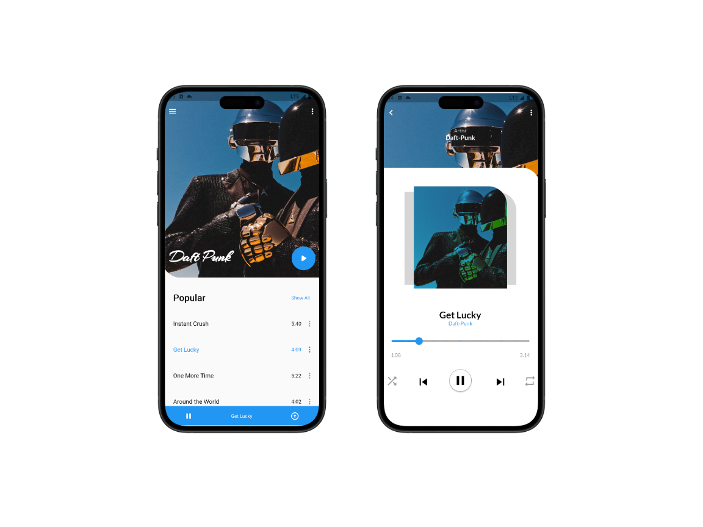

# 🎵 Jukebox – Application de Streaming Musical 🎵

<div align="center">
  <h2>📱 Projet Flutter 📱</h2>
  
</div>

---

## 🌍 Description

**Jukebox** est une application mobile développée avec **Flutter** permettant aux utilisateurs de :
- 🎶 Écouter des musiques en streaming
- 🔎 Parcourir une bibliothèque musicale dynamique
- ❤️ Ajouter leurs titres préférés à une liste de favoris
- 🔐 Se connecter avec Firebase Auth pour sauvegarder leurs préférences
- ☁️ Stocker et lire les musiques via Firebase Storage/Firestore

Le tout dans une interface fluide, moderne et responsive, pour une expérience musicale simple et agréable !

---

## 🚀 Fonctionnalités

- 📂 Base de données cloud via Firebase Firestore
- 🔥 Authentification sécurisée (email, mot de passe)
- 🎧 Lecture audio avec Flutter & packages audio
- 🧠 Gestion des états (favoris, utilisateur connecté)
- 💾 Synchronisation temps réel avec Firebase
- 🎨 UI responsive, animations fluides et cross-platform (Android/iOS)

---

## 🧰 Technologies utilisées


---

## 📦 Installation

1. **Cloner le repo :**
```bash
git clone https://github.com/TonPseudo/jukebox-flutter.git
cd jukebox-flutter
```

2. **Installer les dépendances :**
```bash
flutter pub get
```

3. **Lancer l’application :**
```bash
flutter run
```

> ⚠️ N'oublie pas de configurer Firebase (google-services.json pour Android, et GoogleService-Info.plist pour iOS)

---

## 📁 Structure du projet

- `/lib/` → Code source Flutter  
- `/assets/` → Images, sons, etc.  
- `/firebase/` → Configuration Firebase (Firestore, Auth, Storage)

---

🙌 Remerciements  
Merci d’avoir jeté un œil à ce projet musical !  
Jukebox a été développé pour apprendre à manipuler **Flutter + Firebase** dans un contexte réel et fun.  
N’hésite pas à l’installer, tester, forker ou contribuer 🎧💛

<div align="center">

⭐ *Un petit like sur le repo fait toujours plaisir !* ⭐

</div>
